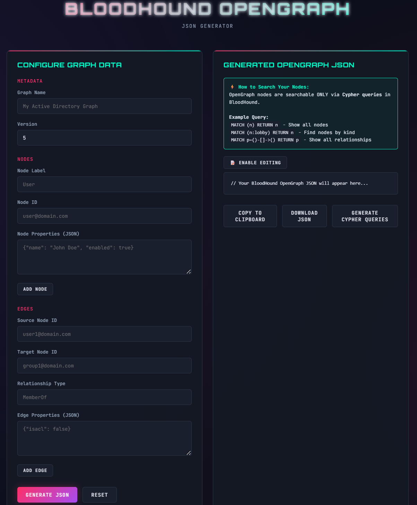
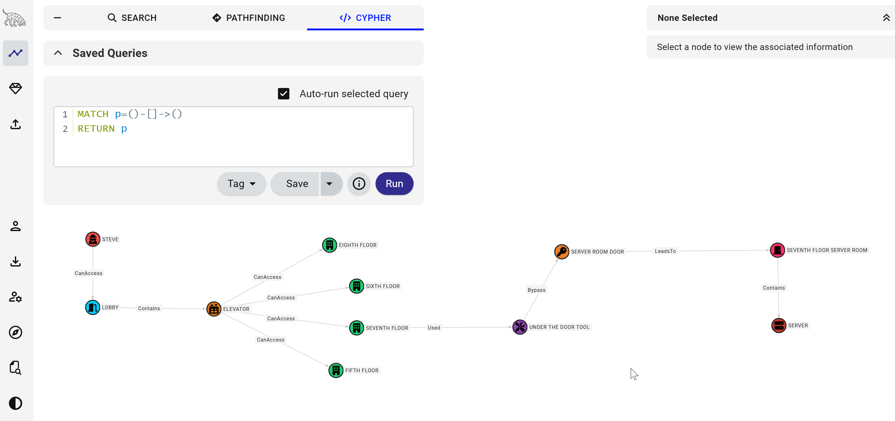

# ScrappyDoo
Opengraph-Compatible JSON Generator for BloodHound

### What is this?
ScrappyDoo is a very simple self-hosted web app that can be used to generate BloodHound Opengraph-compatible JSON that can be mapped using BloodHound CE.

### Why is it called ScrappyDoo?
If SharpHound is ScoobyDoo, this extremely simplistic JSON generating web application is ScoobyDoo's nephew (ScrappyDoo). Diehard ScoodyDoo fans (which is apparently a thing) all thought ScrappyDoo was a crap character, and this is a crap web app. So it made sense.

### Use Cases
The primary use case for this application is to be able to create a graph of attack paths that cannot be collected using SharpHound or any other Opengraph collector. Such paths include:
  - Physical Attack Paths
  - Web Application Attack Paths
  - Hardware Device Attack Paths
  - Recreating an attack path from memory if you lost access to your BloodHound instance/data
  - Literally anything you can think of

By manually creating nodes and edges for the above scenarios, you can include map screenshots of attack paths in reports or client slide decks for presentations of findings after the conclusion of an engagement.

### How to Use
The web app is pretty simple:
  - Create your nodes (objects)
  - Created your edges (relationships between objects)
  - Download the JSON
  - Upload to BloodHound
  - Use custom cypher queries to query your data

### Web App UI

### BloodHound Sample Physical Attack Path
  - All BloodHound data was created with the above pictured web app UI
  - This attack path graphs the attack path for a physical attack path which cannot be obtained by a traditional collector

### Extra Functionality
There are a handful of extra functionalites:
  - Generate cypher queries (hit and miss)
  - Edit JSON in the web app after it is generated in case of a typo or whatever else requires editing

### Known Issues
There are a few issues:
  - Some of the generated cypher queries might not work
  - To query full attack paths in BloodHound, you need to make sure the `"isTraversable" : true` property is included on the edge
  - You will need to create your own icons file to have the node icons populate in BloodHound (sample included in repo for the shown attack path)
